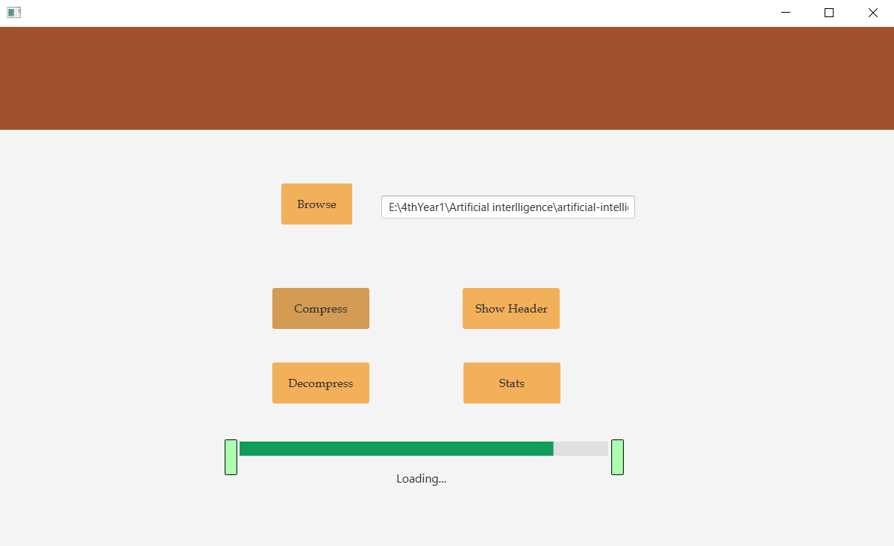
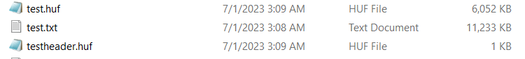

 <h1>Huffman Coding</h1>
  

    Huffman coding is a lossless data compression algorithm that assigns variable-length codes to input characters based
    on their frequencies. This algorithm ensures efficient compression by giving shorter codes to more frequently occurring
    characters and longer codes to less frequent characters.
  

  <h2>Project Implementation</h2>
  

    In this project, I have implemented the Huffman coding algorithm from scratch, including all the necessary data structures.
    The program utilizes a manually implemented priority queue and a binary tree to achieve file compression and decompression.
  

  <h2>Summary of Processing</h2>
  

    The program performs the following steps:
  

  <ol>
    <li>Reads the specified file and counts the frequency of all characters in the file.</li>
    <li>Creates the Huffman coding tree based on the frequencies using the manually implemented priority queue and binary tree.</li>
    <li>Creates a table of encodings for each character from the Huffman coding tree.</li>
    <li>Encodes the file and outputs the encoded/compressed file (compressed.huf).</li>
    <li>Reads the compressed file, decodes it using the Huffman coding tree, and outputs the decoded file (uncompressed.*).</li>
  </ol>

  

  
  

